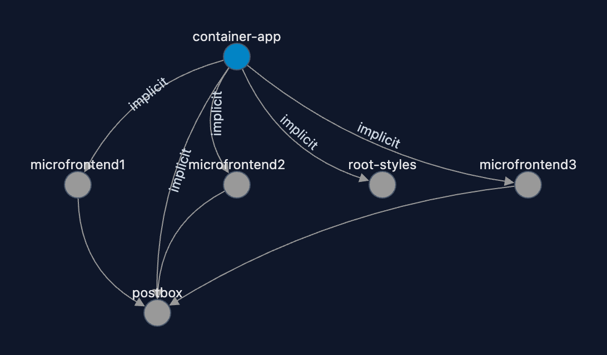

# Architecture

## Overview

This project implements **micro-frontends without import maps**. Rather than relying on a shared module registry at runtime, each micro-frontend is an independently built and served JavaScript bundle. The container-app discovers and loads them dynamically by injecting `<script type="module">` tags pointing to each bundle's URL.

This approach keeps every micro-frontend fully decoupled at the framework level — React, Svelte, and Vue coexist without sharing a runtime — while still enabling hot-reloading during development and a unified shell experience in the browser.

---

## Project map

| Project | Framework | Dev port | Role |
|---|---|---|---|
| `container-app` | Vue 3 | 4173 | Host shell — loads and mounts all micro-frontends |
| `microfrontend1` | React | 5001 | React micro-frontend |
| `microfrontend2` | Svelte | 5002 | Svelte micro-frontend |
| `microfrontend3` | Vue 3 | 5003 | Vue micro-frontend |
| `root-styles` | — | 5004 | Shared Tailwind CSS v4, built and served as a static asset |
| `postbox` | — | — | Local pub/sub library for cross-module communication |
| `mock-api` | — | 3031 | JSON Server mock REST API |

---

## NX dependency graph



NX manages build orchestration across the monorepo. The dependency graph guarantees:

- `postbox` is always built before any micro-frontend (it is a `file:` dependency in each MFE's `package.json`)
- `root-styles` and all micro-frontends are built before `container-app`
- Unchanged projects are restored from the **local NX build cache** — no redundant rebuilds

---

## Runtime loading flow

```
container-app (port 4173)
  │
  ├─ reads config/index.ts
  │     microfrontend1 → http://localhost:5001/microfrontend1/assets/index.js
  │     microfrontend2 → http://localhost:5002/microfrontend2/assets/index.js
  │     microfrontend3 → http://localhost:5003/microfrontend3/assets/index.js
  │
  ├─ MicroFrontendLoader.loadAndMount(moduleKey, url, containerId)
  │     1. injects <script type="module" async src="{url}?{cache-bust}">
  │     2. waits for script load
  │     3. calls window[moduleKey].mount(containerId)
  │
  └─ on unmount
        1. calls window[moduleKey].unmount(containerId)
        2. removes <script> from DOM
```

Each micro-frontend bundle, when loaded, registers itself on `window`:

```ts
// example: microfrontend1/src/index.tsx
window.microfrontend1 = {
  mount(containerId: string) {
    ReactDOM.createRoot(document.getElementById(containerId)!).render(<App />)
  },
  unmount(containerId: string) {
    document.getElementById(containerId)!.innerHTML = ''
  },
}
```

All three micro-frontends follow the same `{ mount, unmount }` contract regardless of their framework, defined by the `MicroFrontend` interface in `container-app/src/types/MicroFrontend.ts`.

---

## Cross-module communication — postbox

`postbox` is a local library (`file:../postbox`) that provides a pub/sub singleton over the browser's native `postMessage` API. It is imported by every micro-frontend and by the container-app.

```ts
// publish (from any module)
const postbox = window.usePostbox()
await postbox.pub('topic-name', { action: 'some-action', params: { ... } })

// subscribe (from any module)
window.usePostbox().sub('topic-name', (params) => { ... })
```

`window.usePostbox()` is initialised once on `window.top` the first time any module imports `postbox`, so all modules — regardless of which iframe or script context they live in — share the same instance.

---

## Shared styles — root-styles

`root-styles` is a dedicated Vite project that builds the shared **Tailwind CSS v4** stylesheet and serves it on port 5004. It uses `@tailwindcss/vite` (no separate PostCSS config needed) and scans all micro-frontend source files for class names via `@source` directives in `src/style.css`.

During development the built CSS is available at:
```
http://localhost:5004/dist/assets/style.css
```

---

## Development HMR loop

```
[microfrontend source change]
        │
        ▼
  Vite build watcher (vite build --watch)
  rebuilds → microfrontend1/assets/index.js
        │
        ▼
  WatchBuildsAndNotifyPlugin (chokidar, in container-app)
  detects file change in ../microfrontend1/microfrontend1/
        │
        ▼
  server.hot.send('module-change', { key: 'microfrontend1' })
        │
        ▼
  App.vue (container-app)
  import.meta.hot.on('module-change', debounced handler)
        │
        ▼
  unloadMicrofrontend('microfrontend1')
  loadMicrofrontend('microfrontend1')   ← re-injects <script> with new cache-bust param
```

The debounce (1 second, via `@builtwithjavascript/debounce`) prevents multiple rapid reloads when a build emits several files at once.

---

## Build outputs

| Project | Output directory | Entry asset |
|---|---|---|
| `container-app` | `dist/` | `assets/main.js` |
| `microfrontend1` | `microfrontend1/` | `assets/index.js` |
| `microfrontend2` | `microfrontend2/` | `assets/index.js` |
| `microfrontend3` | `microfrontend3/` | `assets/index.js` |
| `root-styles` | `dist/` | `assets/style.css` |
| `postbox` | `dist/` | `postbox.es.js` / `postbox.umd.js` + `types.d.ts` |

All Vite builds share these settings: `cssCodeSplit: false`, `sourcemap: false`, `minify: false` — keeping bundles readable and predictable during development.
