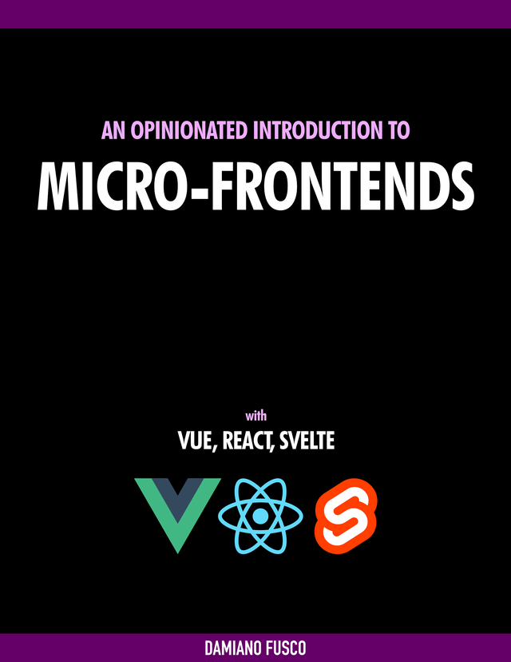

# introduction-to-micro-frontends-project

### Companion code for the book:

 

[An Opinionated Introduction to Micro-frontends](
https://leanpub.com/introduction-to-micro-frontends "An Opinionated Introduction to Micro-frontends")


## Install npm packages on each microfrontend
First, run `npm i` in each sub-directory:
- container-app
- microfrontend1
- microfrontend2
- microfrontend3

## Running
From root directory, run:
```npm run serve```
